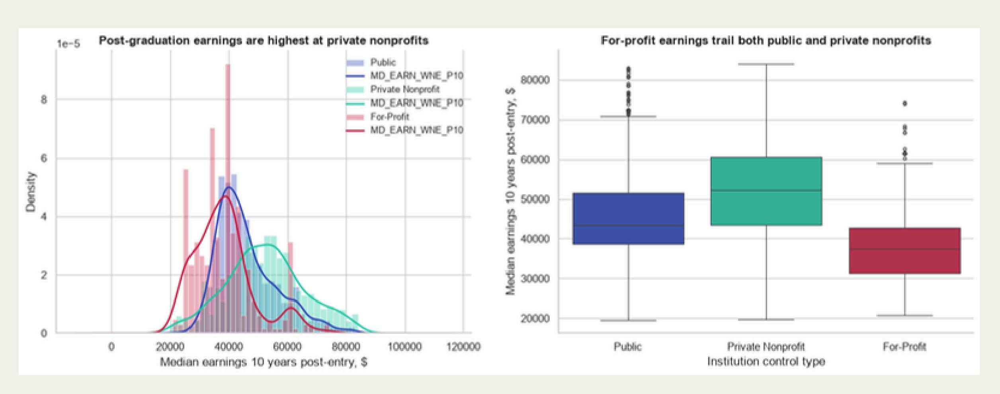
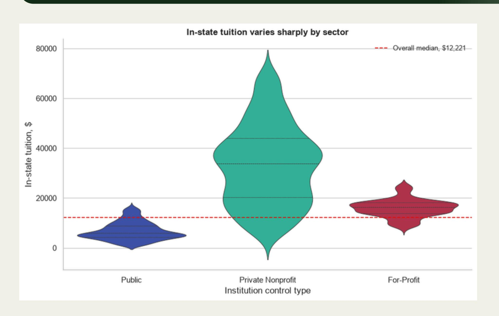
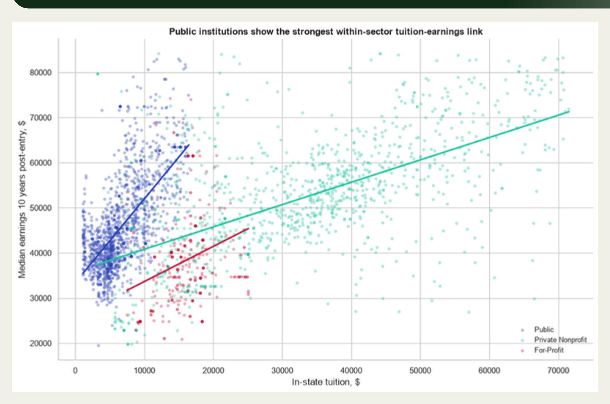
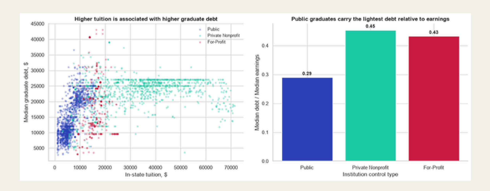

## PHASE 1

- Libraries & Data Set
- Data Cleaning
- Exploratory Data Analysis (EDA)
- Research Question
- Statistical Inference

### Data Set & Libraries

#### **ABOUT THE DATA SET**

#### College Scorecard Subset

- Source: U.S Department of Education
- Observations: 6,273 institutions
- Variables: 24 institutional and financial attributes

#### **KEY VARIABLES**

- In-state tuition and fees
- Median earnings 10 years after entry
- Institutional control type (public, private nonprofit, for-profit)
- Median graduate debt
- Undergraduate enrollment

#### **LIBRARIES**

#### Pandas & Numpy

• Data cleaning, manipulation, and numerical operations

#### Matplotlib & Seaborn

• Data visualization and exploratory analysis

#### Scipy.stats

• Statistical testing (normality tests, correlation analysis)

#### Statsmodels

• Statistical modeling and diagnostic tools

### Data Cleaning

- SAT scores (83.5% missing) and admission rates (69.6% missing) were excluded from analysis due to high levels of data gaps
- Converted "PrivacySuppressed" values in graduate debt to missing (NaN)
- Dropped observations missing tuition, earnings, or graduate debt
- Removed institutions with \$0 in-state tuition
- Imputed missing undergraduate enrollment using sector-specific medians
- Removed duplicate institutions (UNITID)
- Applied IQR-based outlier removal:
  - o Earnings (global)
  - Tuition (within sector)
- Created CONTROL\_LABEL for interpretability

FINAL DATA SET: 2,894 institutions

#### Exploring six (6) questions examining:

- Earning and tuition distributions
- Cross-sector comparisons
- Tuition-earnings relationship
- Debt and selectivity effects
- Equity differences across Minority Serving Institutions (MSIs)

#### *Earnings Distribution By Sector*

- Private nonprofit institutions had the highest median and mean earnings
- For-profit institutions had the lowest median earnings
- Private nonprofit institutions showed the greatest variation in earnings
- Earnings distributions overlapped across all three sectors

#### *Tuition Distribution By Sector*

- Private nonprofit institutions charged the highest tuition
- Public institutions had the lowest tuition
- For-profit tuition was between public and private nonprofit institutions
- Tuition distributions were more separated than earnings distributions

#### *Joint Tuition-Earnings Relationship*

- Tuition and earnings were moderately positively correlated
- Public institutions showed the strongest within sector correlation
- For-profit institutions showed the weakest correlation
- Institutions formed distinct clusters by sector

#### *Debt As A Mediating Variable*

- Higher tuition was associated with higher graduate debt
- Public institutions had the lowest median debt to earnings ratio
- Private nonprofit and for profit institutions had higher debt burdens relative to earnings

#### Admissions Selectivity and Earnings by Sector

- Higher admissions selectivity is consistently associated with higher graduate earnings across all sectors.
- The positive correlation between tuition and earnings persists even when comparing schools of similar selectivity.
- Selectivity explains some of the variance, but it does not fully account for the tuition-earnings relationship in the broader market.

#### Minority-Serving Institution Profiles by Sector

- Minority serving institutions generally charged lower tuition within each sector
- Minority serving institutions generally reported lower median earnings
- Most minority serving institutions were in the public and private nonprofit sectors

Note: The For-Profit sector was severely underrepresented in admissions reporting data.

### Research Question

**Is there a significant relationship between in-state tuition and median post-graduation earnings, and does this relationship differ across public, private nonprofit, and for-profit institutions?**

### Statistical Inference

To test the relationship between in-state tuition and post-graduation earnings, we conducted a correlation analysis with an assumption check for normality.

#### **Hypotheses**

- H₀: There is no linear relationship between in-state tuition and median post-graduation earnings (r = 0)
- Hₐ: There is a significant relationship between in-state tuition and median post-graduation earnings (r ≠ 0)
- Significance level: α = 0.05

#### **Methodology**

- Normality was tested using the D'Agostino K-squared test
- Since earnings data were not normally distributed (p < 0.05), we used Spearman rank correlation instead of Pearson correlation. It does not assume normal distribution, captures monotonic relationships, more appropriate for skewed real-world data.

#### **Results**

- Normality test p-value: 0.0000
- Spearman correlation coefficient (r): 0.4641
- p-value: 1.53 × 10⁻154

#### **Conclusion**

Reject the null hypothesis. There is a statistically significant moderate positive relationship between in-state tuition and post-graduation earnings.

# Thank You!

*Antiado, Cuevas, Divina, Martinez, Sison*